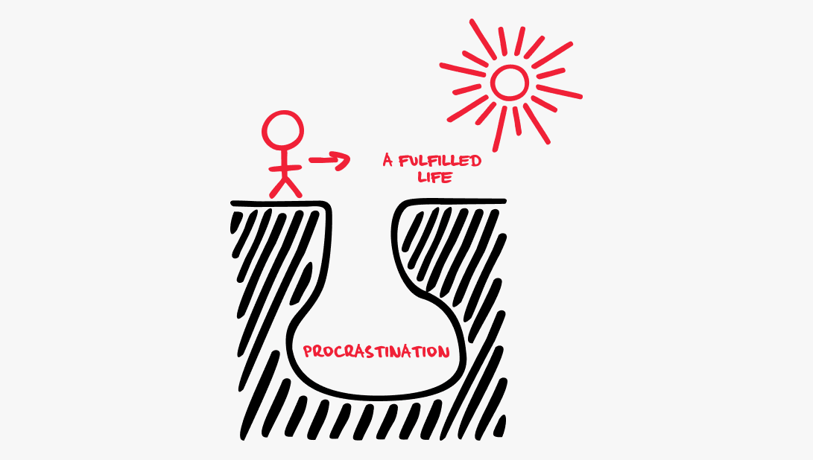

# Заголовок 1
## Заголовок 2
### Заголовок 3
#### Заголовок 4
##### Заголоаок 5


Заголовок 1
=

Заголовок 2
-

1. пункт списк
    + пункт списка
    + пункт списка
    + пункт списка
2. пункт списка
    * пункт списка
    * пункт списка
    * пункт списка
3. пункт списка 
    - пункт списка
    - пункт списка
    - пункт списка

***

Все уроки с **заданиями** доступны в курсе на __Stepik__:(можно смотреть уже сейчас и не ждать ___выхода___ отдельных уроков)
Весь курс в ***одном уроке***.   
  • *Git* и *GitHub* для _начинающих_ 2024   
  
  (все уроки уже доступны в одном большом видео длительностью более 3 часов)

  `
  idi nachui
  `

```
$a = 5;
$b = 3;
$c = $a + $b;
```

>Какая-то цитата  
Новый текст

[Текст](https://www.youtube.com/watch?v=_HH1HS1gKHc&list=RD_HH1HS1gKHc&start_radio=1)



[](https://www.youtube.com/watch?v=_HH1HS1gKHc&list=RD_HH1HS1gKHc&start_radio=1)


Item     | Value | Quantity
:------- |:---:  | --------:
Computer | 1600  | 3
Phone    | 12    | 2
Pipe     | 1     | 1